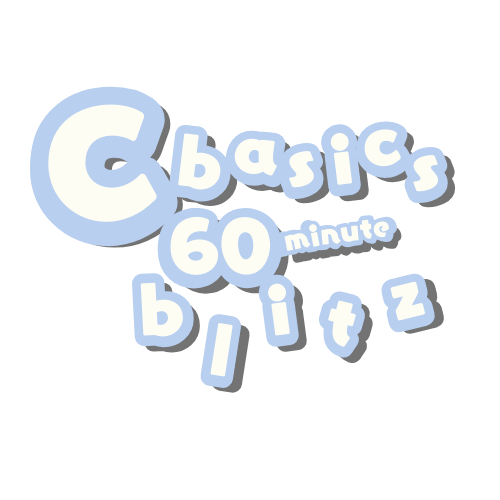

# C basics 60 minute blitz 
Repo designed to quickly get one up to speed on c fundamentals.



## Topics covered include:
- pointers
- double pointers
- void pointers for generic data
- malloc(), free(), memcpy()
- struct, typedef, sizeof
- String termination, length calc, copying, chars
- File I/O
- command line args to programs
- simple testing with no added dependencies
- makefiles

## What is implemented in this project
1. A Generic Linked List
2. A String implementation that uses the Linked List
3. A main file called reverse_file that uses the above to reverse text


## Compilation


### Compiling the Linked List Implementation

```bash
# Compile the test file - it will automatically include linked_list.c
gcc -Wall -Wextra -g -o test_linked_list test_linked_list.c linked_list.c

# Run the tests
./test_linked_list
```

The compilation flags we're using:
- `-Wall -Wextra`: Enable comprehensive warnings
- `-g`: Include debugging information
- `-o test_linked_list`: Name the output executable

### Compiling the Linked String Implementation

```bash
# Compile the test file
gcc -Wall -Wextra -g -o test_linked_string test_linked_string.c linked_string.c linked_list.c

# Run the tests
./test_linked_string
```

### Compiling the File Reverser

```bash
gcc -Wall -Wextra -g -o reverse_file reverse_file.c linked_string.c linked_list.c

# Test it with a sample file
echo "Hello, World!" > input.txt
./reverse_file input.txt output.txt
cat output.txt
```

## Using Make (tying everything together)

Makefile ties together the the compilation and testing of project files.

```bash
# Build everything
make

# Run all tests
make test

# Clean up
make clean
```

# The Generic Linked List

Coding a Linked List that can store any type of data. 

## Pointers

```c
typedef struct Node {
    void* data;         // Points to our stored data
    size_t data_size;   // Tells us how big that data is
    struct Node* next;  // Points to the next node
} Node;
```

Each node contains two different types of pointers:
1. A void pointer (`void* data`) that can point to any type of data
2. A pointer to another node (`struct Node* next`)

Shows:
- Why we need to track sizes when working with void pointers
- How structures can contain pointers to themselves
- The difference between pointers to data and pointers to structures

## Memory Management

```c
Node* new_node = malloc(sizeof(Node));  // Allocate the node
new_node->data = malloc(data_size);     // Allocate the data
```

Every node creation involves two memory allocations:
1. Memory for the node structure itself
2. Memory for the data the node will store

Shows:
- Dynamic memory allocation
- Memory leak prevention
- The relationship between pointers and allocated memory
- Why we need to track memory sizes
- How to clean up complex data structures

## Generic Programming in C

```c
void append_node(Node** head, void* data, size_t data_size) {
    // Create a new node with ANY type of data
    Node* new_node = create_node(data, data_size);
}
```

Shows:
- How to write code that works with any data type
- Why size tracking is necessary with void pointers
- How to safely copy data of any type
- The trade-offs between type safety and flexibility

## Error Handling Patterns

```c
Node* create_node(void* data, size_t data_size) {
    Node* new_node = malloc(sizeof(Node));
    if (new_node == NULL) return NULL;  // Handle allocation failure
    
    new_node->data = malloc(data_size);
    if (new_node->data == NULL) {
        free(new_node);                 // Clean up partial allocation
        return NULL;
    }
}
```

Shows:
- How to handle memory allocation failures
- The importance of cleaning up partial allocations
- Why NULL checks are critical in C
- How to propagate errors up the call stack

## Implementing Linked List

When working with the generic linked list:
1. First implement `create_node` and basic memory management
2. Then add `append_node` for list building
3. Finally implement `reverse_list` for more complex pointer manipulation

Make sure you can create lists of:
- Integers
- Characters
- Custom structures

# Building a String Type with Our Generic List

In C, strings are just arrays of characters ending with a null terminator (`\0`). This is simple but has limitations:
- Fixed size once allocated
- Need to manage their own memory
- No built-in operations like reverse or append
- No length tracking

Our LinkedString solves these problems:

```c
typedef struct {
    Node* head;     // generic list storing characters
    size_t length;  // Current string length (no counting needed!)
} LinkedString;
```

// TODO: finish instruction on String impl
